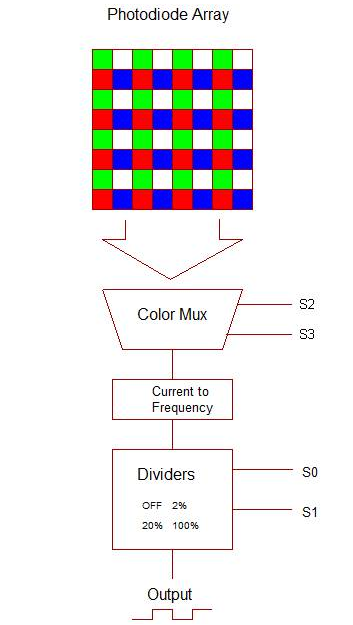
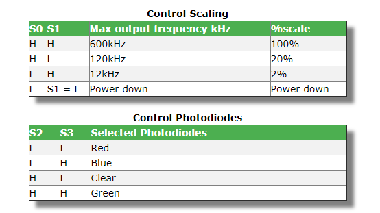
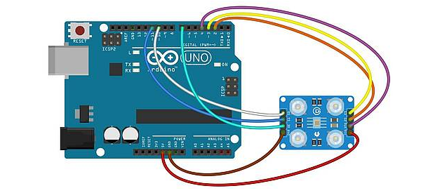

# Industrial Automation

Industrial Automation as the name reflects is a process of atomizing the present industries by using technology. It uses control systems such as computers and information technology for handling different processes and machineries in an industry to replace human beings. It deals primarily with the automation of manufacturing, quality control and material handling processes.

## 🔨 Basic Working

Here in this project we have designed a simple circuit which will be helpful in the packaging processes. This project is used for detecting the colors of packages and other printed items after which a direction is displayed as to where the package is to be transported. By using the servo, a hand is provided which will place the boxes or item at required position. This will be very useful in the packaging sections of industries as it will reduce the human labor and also the time consumption would be less. Not just this but the manual errors which is a usual complaint of customers, gets way too minimize.   

Firstly, the color sensor is connected to arduino uno. The TCS230 color detector measures three primary colors Red, Green and Blue and also has a separate white light detector. Since any color can be created from different levels of these primary colors, you can find out the color composition of a light source. 

Here is the basic idea about how the sensor actually works.

### Frequency Outputs

The maximum full scale frequency output from the TCS230 are shown below for the scaling factors controlled by S0 and S1. Scaling is really just using an internal clock chip that counts the input signal (the primary clock output from the photodiode current to frequency converter) and generates divided down clocks.

- For the TCS230, TCS3200 and TCS3210 the above parameters are identical.

### Calibration

The sensor is very sensitive to any changes in light and in practice that means any slight distance changes from the sensor to the object will cause a different reading. Additionally any ambient light changes will also cause a different reading.

So to make accurate (repeatable) readings you need to control two elements:

- Ambient light.
- Distance to object.
To calibrate the sensor, push the sensor down onto colored paper as even a small adjustment fails since the sensor is extremely sensitive.

Set the serial monitor to 115200 Baud and push the sensor down and hit the 'Enter' key in the serial monitor input field. This will then show you the current RGB values. Copy these values into the RBG array and set the equivalent colname text. Recompile (or add some different colored objects). Recompile and check that the 'color' is found.

Now you can test the 'objects' with the code now reporting the color of the object.
As for "real" calibration- Its difficult and the only way you will achieve it is to place the sensor in a closed environment where you can control the lighting levels - this will give repeatable reliable measurements.

### With Arduino

Connect the pins according to given code, although the basic connection is shown in diagram(for reference). Then use liquid crystal connections to display the data on LCD, with that the output can be viewed on serial monitor. With proper connections, test the sensor by taking coloured papers, here the code has been done for few colours and it could be increased as per the requirement of application. After receiving different intensity colours, the sensor will respond on the basis of that intensity and wavelength.

## Dependencies

- Arduino
- TCS230 colour sensor with 8*8 matrix
- LCD

## 📦 Install

Open the code Arduino software and save as '.ino' file, after downloading the required pacakages,like 'liquid crystal' in library.These pacakages are available on GitHub and other online platforms as per the choice of project builder. 

After saving the code and connecting the components together, run it and view the output 'Arduino Serial Monitor', as the leds on colour sensor starts blinking. 

